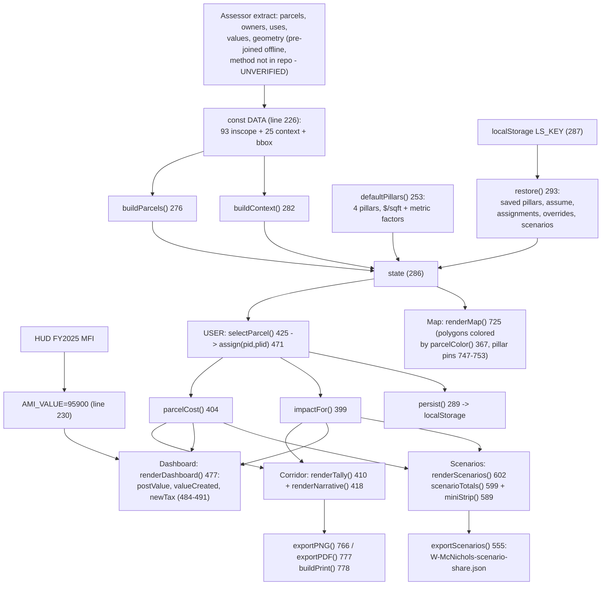
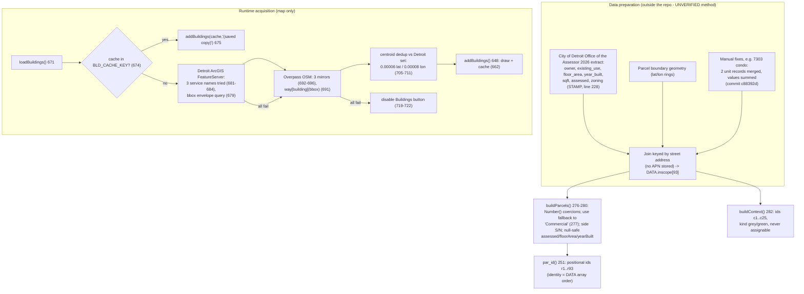
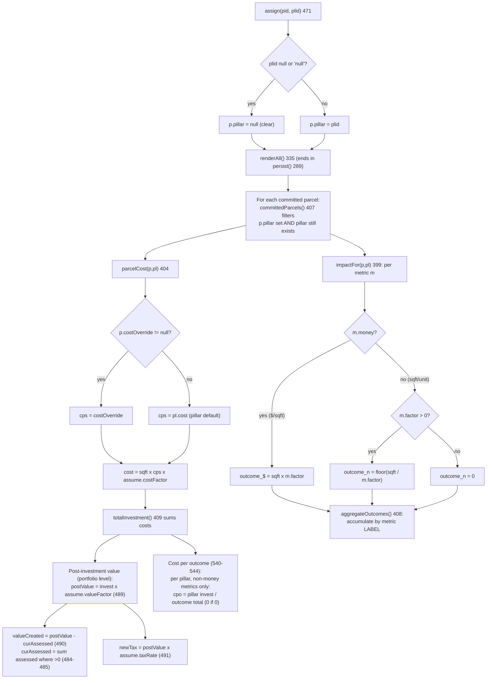
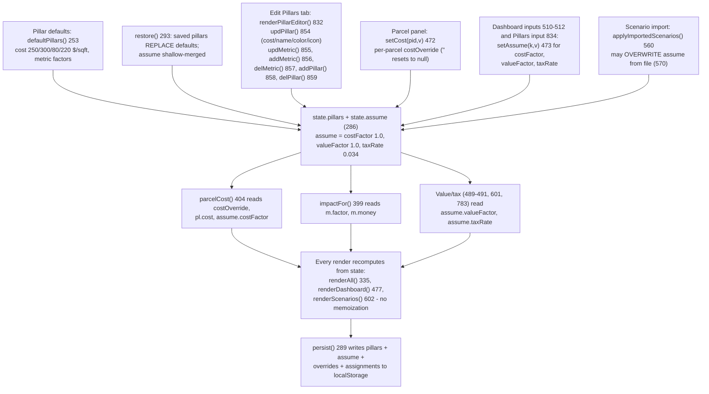
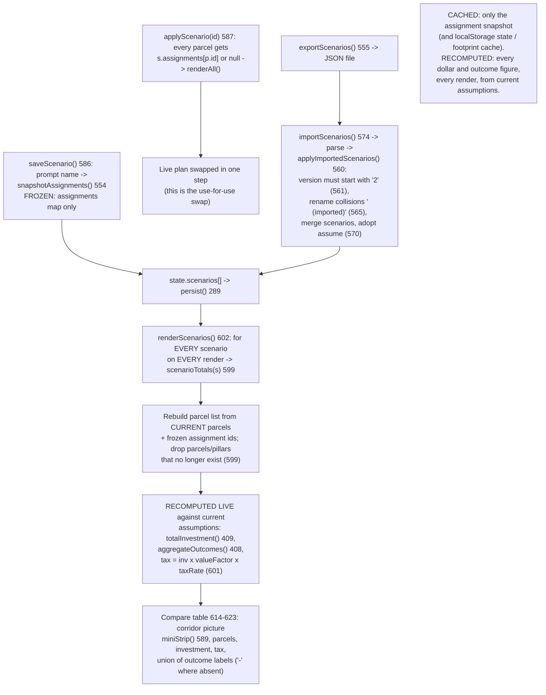
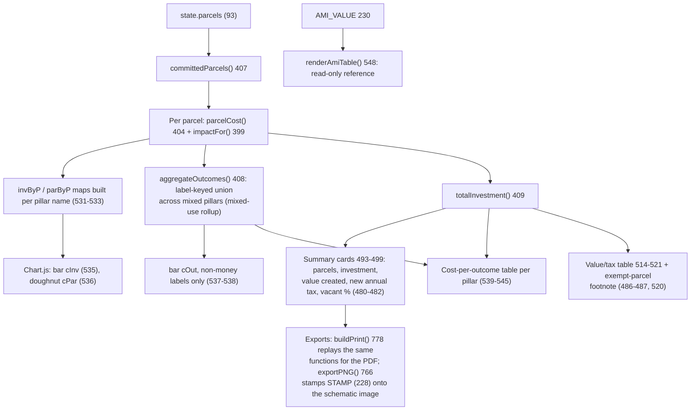
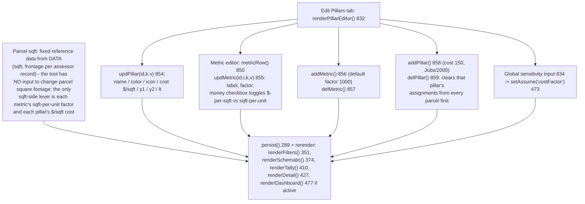

# METHODOLOGY FLOWCHARTS — The Investment Map

Prepared 2026-08-03. Attorney work product. Every node names the actual
function, constant, or file location in `McNichols_Kresge_DEMOv2.html` (line
numbers in labels). Companion to TECHNICAL-DISCLOSURE.md.

## 1. Master flow — raw inputs to the decision output

## 2. Data acquisition and normalization

Parcels, zoning, land use, ownership, and valuation are pulled and joined
BEFORE the code runs; the file ships with the joined result. AMI is a single
embedded constant. Only building footprints are acquired live.

## 3. Investment pillar logic — every branch

## 4. Assumption engine — entry, storage, override, propagation

## 5. Scenario comparison — swap and recompute; cached vs recomputed

## 6. Portfolio rollup — parcel to dashboard across pillars

## 7. Configuration flow — pillars and square-footage inputs

Note on diagram 7: the disclosure request asked "how square footage inputs are
changed." In this build parcel square footage is immutable assessor reference
data (`DATA`, line 226); user-changeable square-footage-related inputs are the
metric factors (sqft per unit) and pillar/parcel costs per sqft, as drawn. A
proposed-building-sqft input is part of the planned development-modes
embodiment (TECHNICAL-DISCLOSURE.md §12.1), not this build.
